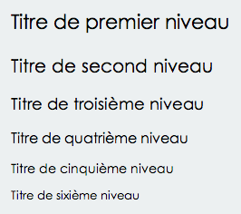

# Conception de l'interface

Cette partie reprend les étapes par lesquelles je suis passé pour la conception de l'interface. Beaucoup de points sont directement liés à l'observations des sites dan le chapitre précédant.

## Maquettes zoning

Une des première étape est de réaliser des maquettes. C'est important pour ne pas se lancer aveuglément dans le design, et gagner de temps. Cela permet aussi de prévoir l'emplacement des fonctionnalités et l'architècture générale de la page. En début d'année j'avais fait une série de zonning, maintenant beaucoup de choses on changés.

L'idée était de présenter ces conceptes à la classe pour que l'on discute ensemble. Ces brainstormings on permis à chaque étudiants d'avancer énormément dans la pré-conception de leur interface. Personnellement, beaucoup de commentaires reçu ce jour la m'ont ouvert les yeux sur certain défauts de conceptions. J'ai aussi reçu beaucoup d'idées de fonctionnalités. En conclusion, cette partie m'apporta beaucoup et me fit changer plusieurs mauvais choix que j'avais fait: voici les maquettes avant la réunion, et le site en suivant les conseils.

Image 6-1: Maquette du site en début d'année.

Image 6-2: même page que la maquette mais sur le site actuel.

## Navigation
La navigation du site est composée de deux niveaux différents. La navigation principale située en haut de page, permet d'accéder aux différentes sections principales. Ensuite, au niveau du contenu se situe la navigation secondaire, qui elle, est différente en fonction de la section.

Exemple: 

Image 6-3: Utilisateur non connecté sur la section recherche.

Image 6-4: Utilisateur non connecté sur la partie communauté.

Image 6-5: Utilisateur non connecté sur le profil d'un autre utilisateur.

Image 6-6: Utilisateur connecté sur son tableau de board.

J'ai choisi ce type de navigation pour simplifier la navigation dans le site. Pour ce faire j'ai du déterminer les sections principales du site et regrouper les actions par sections. J'ai basé ceci sur les résultats du test des cartes dans la partie test utilisateurs.

Dans ce genre de navigation, si l'utilisateur veut rechercher quelque chose, il ne sera pas dérangé par les actions des autres sections. Mais j'ai quand même ajouter à chaques fois des liens renvoyant vers les autres sections, ou parfois directement vers des actions spécifiques. C'est aussi pour cela que le menu est en position fixe en haut de la page. Pour rappeler à chaque instant la présence de ces sections aux utilisateurs.

## Couleurs

Image 6-7: Voici la palette couleur du site.

Les couleurs sélectionnées sont des couleurs vives, offrant de bon contrastes. Le style principale de la page est dans les tons clairs (blanc, et gris clair), tandis que les actions sont dans des couleurs vives pour ressortir et attirer le regard. Ce genre de contrase est souvent utilisé sur le site pour donner envie à l'utilisateur d'effectuer des actions.

Image 6-8: exemple de bouton d'action.

## Typographie

Pour la police de caractère des textes j'ai sélectionné cette font-stack: Candara, Calibri, Segoe, "Segoe UI", Optima, Arial, sans-serif. Avec en police principale «Candara» qui a un support de 83.41% sur windows et 38.74% sur Mac. J'ai sélectionné cette police surtout à cause de ses chiffres. En effet cette police possède des chiffres elzéviriens, qui sont beaucoup plus agréables dans les blocs de textes que les normaux. Vu que ce site affiche souvent des chiffres: distances, prix, nombres d'entraînements… je me suis dit que cette police était parfaite.

Le texte de base est en 16px pour offrire un confort de lecture aux utilisateurs. De plus la police étant noir sur fond blanc, donc il n'y a auqun problèmes de contraste.

Image 6-9: voici la police Candara.

Et pour les titres voici la font-stack: "Century Gothic", CenturyGothic, AppleGothic, sans-serif. La police principale, «Century Gothic», à un support de 87.62% sur Windows et de 53.15% sur Mac. Mon choix c'est tourné vers cette police elle offre des courbes agréables qui retire la froideur que l'on pourrait retrouver sur Helvetica par exemple.

Image 6-10: voici la police Century Gothic.

Voici l'échelle des titres créée sur http://typs.hupkens.be/ sur base π/2.

	h6      { font-size: 0.798em;}
	h5      { font-size: 0.893em;}
	h4      { font-size: 1em;}
	h3      { font-size: 1.12em;}
	h2      { font-size: 1.253em;}
	h1      { font-size: 1.403em;}
	

Image 6-10: voici le résultat de l'échelle des titres.

## Contenus non-textuels

Toutes les icones du site proviennent toutes de fontello (http://fontello.com).

## Adaptabilité

Il est important que le site s'adapte en fonction des conditions des utilisateurs. Qu'ils soient sur un smartphone, sur une tablette, ou sur un pc, le site doit pouvoir proposer ses services d'une manière convenable.

On oublie aussi souvent les utilisateurs qui n'ont pas javascript (ceux qui utilisent un lecteur d'écran par exemple). Il faut donc penser aussi à la dégradabilité du site.

### Responsive

Le site est responsive pour être utilisable sur n'importe quel appareil. J'ai donc créé une grille de base (avec «neat»), et cette grille s'adapte en fonction de plusieurs points.

Image 6-11: voici le site avec la grille activée.

- 1080px pour les grands écrans.

- 935px passage aux écrans moyens, pas de changements depuis le breackpoint précédant.

Image 6-12: voici le site en 1024px de large.

- 700px passage aux tablettes (et grands smartphones). Le breackpoint s'explique surtout par le changement de navigation. Arrivé à cette largeur le menu principale est trop large, alors je le supprime et j'affiche un menu verticale en bas de page. Le bouton navigation qui remplace l'ancien menu est une ancre qui renvoi à la navigation en bas de page.

Image 6-13: voici le site en 650px de large.

- 480px Finalement le passage aux versions mobiles. Á Partire de ce point-ci, toutes les colonnes ont une longeure de 100%.

Image 6-13: voici le site en 450px de large.

- 300px Pas de changements nottables à cette largeure, juste une redimention.

### Dégradable

J'ai fait en sorte que les utilisateurs ne soient pas bloqués sans javascript. C'est à dire que les fonctionnalités de base fonctionnent sans javascript activé, et elles sont enrichies à son activation.

Prennons par exemple la liste des tracés sur la carte. Si jamais l'utilisateur ne dispose pas de javascript, je supprime la carte vu qu'elle ne fonctionnera pas, et je lui donne la liste des tracés.

Image 6-9: Liste des tracés avec javascript activé.

Image 6-10: Liste des tracés sans javascript.

Une des seule partie qui n'est pas entièrement dégradable est la création de tracé. Evidement, si l'utilisateur n'a pas javascript il ne pourra pas créer de tracé sur la map. Néanmoins je peux toujours lui proposer de créer son tracé à partir d'un fichier.

## Architecture de l'information

### Sections principales

Le site est découpé en trois grandes sections principales. 

La première est le haut de page. Dans cette section on retrouve la navigation, le logo et sur la page d'accueil, une introduction et un formulaire d'inscription. Sur les autre pages, cette division a la taille la plus petite possible pour donner le plus d'espace possible au contenu.

La seconde section est le contenu. C'est dans cette partie que l'information principale du site se retrouvera. Pour améliorer la qualité visuelle du contenu, le fond est en blanc. Ce fond fait ressortire la section grâce au fond gris clair de la page.

La dernière section est le pied de page. Cette section ne comporte pas beaucoup d'informations. Elle est donc de petite taille. Sa couleur blanche, comme le contenu, la détache du fond mais moins que le contenu. En effet l'absence de bordure donne une impréssion de mélange avec le fond de la page.

### Contrôle