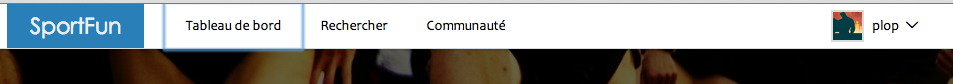

# Accessibilité

## Analyse par rapport au quick scan d'anysurfer

1. Chaque page possède-t-elle un titre significatif?

	Oui, pour chaque page j'ai essayé de donner des titres qui correspondent le plus au contenu de la page. Par exemple:
«Accueil | Sportfun» sur la page d'accueil.
«Évènement «wop» | Sportfun» sur la page de l'évènement «wop».

2. L'ensemble du site est-il utilisable sans faire usage de la souris?

	Le site est accessible au clavier.
	
3. Le focus est-il visible lors de la tabulation?
	
	Les liens et champs au focus sont bien mis en évidence.
	Image 9-1: lien au focus.
	
	
4. Les liens sont-ils facilement identifiables?

	Effectivement les liens sont bien identifiables. Premièrement les liens se trouvant dans du texte sont soulignés. Ensuite il y a les liens «call to actions» qui ont comme but d'attirer l'oeil de l'utilisateur. Pour attirer l'utilisateur ils sont évidement bien mit en évidence.

5. Les intitulés des liens sont-ils significatifs?
6. Les animations peuvent-elles être arrêtées?
7. Les images possèdent-elles une alternative textuelle?
8. Le texte parlé des fragments audio ou vidéo a-t-il une alternative textuelle?

	Le site ne comporte aucune vidéo.


9. Les formulaires sont-ils exprimés en utilisant les balises HTML appropriées?


	Les formulaires sont construits correctement: quand on clique sur le label correspondant à un input, il place le curseur dedans grâce à l'attribut for.


10. Les résultats de validation de formulaire sont-ils expliqués textuellement?

11. Le contraste entre le texte et l'arrière-plan est-il suffisant?

12. Les titres sont-ils exprimés en utilisant les balises HTML adéquates?

13. Les listes sont-elles exprimées en utilisant les balises HTML adéquates?

14. Existe-t-il des alternatives accessibles pour les éléments Flash importants?

15. Le code source de la page d'accueil remplit-il les critères du HTML valide?


## Analyse de performances