# 1.Note d'intention

Détails de la conception du site [Sportfun](sportfun.herokuapp.com).

[Code source](https://github.com/poltib/pfeR)

En passant par la création du cahier des charges, définition du public cible, conception de l'interface, analyse de l'utilisabilité et de l'accessibilité et en fin, par les détails techniques. Ce livre survolera toutes les étapes par lesquelles je suis passé pour développer cette application.

# 2.Motivation personnelle

Le projet de fin d'étude a été pour moi une façon de me mettre à l'épreuve. Concrètement, je me suis fixé une liste d'objectifs à réaliser (chacun lié à une technologie différente). C'est en travaillant de la sorte que j'ai pu acquérir de nouvelles connaissances, tout en développant mon projet de fin d'étude. Finalement, c'est cela qui m'a le plus motivé.

Je pratique personnellement la course à pied, j'ai donc de la chance de me retrouver dans la peau de mes utilisateurs, je peux comprendre leurs attentes, leur motivation mais également d'en côtoyer beaucoup. C'est quelque chose qui me pousse à donner le meilleur de moi-même.

### Objectifs

-	#### Développer une plateforme de partage

	Mon but premier, qui était en même temps ma plus grande motivation, était de réaliser une application qui sert à être partagée. Comme permettre aux utilisateurs d'avoir accès à une bibliothèque de tracés d'entraînements et de pouvoir partager les leurs. Mon objectif était donc de créer un esprit de communauté autour du site, permettant aux utilisateurs une exploitation du site en toute confiance, d'une manière agréable et aisée.
-	#### Manipuler des données géographiques
	
	J'ai toujours été fortement intéressé par tout ce qui concerne carte interactive sur l'internet. Mon sujet de projet se prêtais bien à l'utilisation de cette technologie alors j'en ai profité pour améliorer mes connaissances sur ce sujet. Ici, j'ai utilisé l'API de google map car nous l'avions vu en cours et aussi parce que je trouve leur site de référence très compréhensible. Mais au finale, l'idée principale est de pouvoir être indépendant de ce genre de librairie. Etant donné que le nombre de requêtes par jour sont limité, il est préférable de pouvoir changer de librairie facilement si l'application prend de l'ampleur. Pouvoir changer vers OpenStreetMap serait pour moi une solution exemplaire.
	
-	#### Apprendre un nouveau langage

	En cours, nous avons eu une introduction au PHP (fin de deuxième année), et une introduction au framework Laravel également en PHP. Bien que je trouve ce framework exceptionnel et que j'adore développer des applications avec, j'ai pensé que cela pouvait être utile de regarder ce qui se faisait et pratiquait ailleurs. Pour cette raison, j'ai décidé donc de  développer mon application à l'aide du framework Ruby on Rails (qui utilise le langage Ruby). Je dois avouer que ceci m'a vraiment motivé dans mon développement; autant pour la syntaxe simplifiée du langage, que pour la rapidité avec laquelle on peut prendre en main le framework. Tout m'a séduit et j'ai vraiment pris plaisir à développer ce projet.
	
-	#### Bonne modélisation de base de données

	En plongeant dans Ruby on Rails, j'ai découvert que beaucoup de personnes utilisent postgresSql comme base de données relationnelle. J'ai aussi appris qu'il y a des extensions pour faciliter la manipulations de données géolocalisées, ce qui est justement très utile dans le cas de mon application. J'ai donc décidé d'utiliser ce système  pour la base de données. J'avais comme objectif de modéliser une base de données qui serait la plus extensible possible. En prévoyant également l'ajout possible de nouvelles fonctionnalité.
	
-	#### Affichage de données complexes

	Pour afficher les données proposées aux utilisateurs j'ai décidé d'utiliser des graphiques. C'est très parlant pour l'utilisateur et quand ils sont bien mis en forme, ils valent plus que n'importe quel texte. Parmi mes objectifs, j'ai prévu également d'utiliser la superbe librairie d3 pour l'affichage des graphiques. Néanmoins, dans un premier temps, j'ai préféré d'utiliser celle de googleCharts pour afficher l'élévation le long de tracés sur les cartes.

# 3.Cahier des charges

Dans le monde de la course à pied, le plus intéressant après les entraînements, c’est de participer à une course. Pour pouvoir se mesurer aux autres ou simplement pour vivre une expérience avec d’autres coureurs. Mais avant de participer à une course, il faut en choisir une et ce n’est pas toujours facile. Les publicités sont rares et les informations y figurant ne sont pas toujours telles que le coureur recherche. 

Souvent, les deux informations les plus importantes sont la date et un détail du tracé. Malheureusement, la deuxième est difficile à reproduire sur papier et quand bien même il est imprimé, il serait bon de pouvoir manipuler la carte, inspecter le tracé sous toutes ses coutures.

## Pour les organisateurs

Il n'y aurait pas de courses sans organisateurs. Donc le premier objectif du site est de séduire ces organisateurs. Les mettre en confiance pour qu'ils viennent poster leur courses sur le site.

	Le site permettra aussi aux coureurs d'ajouter les courses eux mêmes. L'idée est de véhiculer un esprit de partage; les coureurs qui trouveront des courses intéressantes les partageront sur le site pour en faire profiter les autres utilisateurs.

### Permettre la création de ces évènements aux organisateurs
	
Ajouter une interface de création d'évènements simples. Je suis persuadé qu'il ne faut pas submerger l'utilisateur de champs à remplir et de l'obliger à tout réaliser d'un coup. La création devrait donc être séparée en plusieurs étapes simples. La première est d'encoder les informations générales; nom, date, description,… Ensuite, il faudrait donner accès à une interface de création de tracés pour pouvoir en ajouter aux évènements. Également, donner la possibilité de modifier et/ou supprimer ces évènements.
	
La création de tracé sur une carte devrait être intuitive et accompagner l'utilisateur lors de sa première utilisation. Ce processus doit être rapide, simple et efficace. L'utilisateur ne devrait pas être découragé par l'utilisation de cet outil. Un plus serait de permettre aux utilisateurs d'ajouter un tracé à partir d'un fichier (de type .tcx, .gpx ou .kml par exemple).
	
Une autre donnée importante pour les organisateurs c'est la participation aux évènements. Il faut donc rendre cette action possible aux utilisateurs. Ensuite lister tout les participants.
	
Dans la même optique, pour augmenter la visibilité de leur publication, il faut ajouter une option de partage. L'idée est d'ajouter des liens pour partager le contenu du site sur les réseaux sociaux, ou par mail. Et finalement, permettre aux utilisateurs d'ajouter l'événement à leurs favoris, comptabiliser ce nombre de favoris et ainsi départager les événements par les utilisateurs.

## Pour les sportifs

### Donner accès à des événements de course à pied aux sportifs

Le premier objectif du site pour les utilisateurs est de proposer des événements de course à pied (au sens large: marche, course, Golden race,…) où l'information principale est(sont) le(s) tracé(s). Il faut donc une interface qui affiche ce(s) tracé(s) sur une carte à l'aide d'une librairie externe (par exemple: Google map, Open Street Map,…). Il faudra donc afficher le tracé de manière précise et visible. Ensuite, ajouter d'autres informations, un plus serait de proposer l'élévation le long du tracé (détail des changements d'altitude).
	
Le second objectif est de proposer à l'utilisateur une liste de ces évènements avec des options de tri et un outil de recherche facile à prendre en main et efficace. Cette liste devrait comporter des informations cruciales sur les événements pour permettre aux utilisateurs un gain de temps dans leur recherche et ne pas les renvoyer sur des pages d'événements qui ne les intéressent pas. Par exemple donner les distances des tracé, la date, le lieu,…
	
### Donner accès aux tracés

Vu que les tracés sont la base des événements du site, il est donc normal de proposer aux utilisateurs une partie qui leurs est entièrement consacrée. Et, par la même occasion, proposer de nouvelles fonctionnalités.

Tous les tracés créés, que ce soit pour un événement, ou un tracé tout court, seront listés dans une section «Tous les tracés». Cette section devrait les afficher de manière interactive et en fonction de la position de l'utilisateur.

Sur la page de chaque tracé rendre les tracer téléchargeables. Beaucoup de personnes pratiquant les randonnées ou la course à pied aiment planifier leurs activités. L'idée est donc de répondre à ce besoin en leur donnant accès à l'éditeur de tracé indépendamment des événements, et après le création rendre le tracé exportable en plusieurs types de fichiers (.gpx, .kml, .tcx,…).

### Donner accès à des groupes d'entraînements

La course à pied est un sport individuel, ce qui implique une grande force d'esprit. Malheureusement, ce n'est pas inné chez tout un chacun et donc cette force se forge aux cours de nombreuses heures d'entraînements. Le fait d'aller s'entraîner seul est souvent un gros problème pour les débutants. Il existe bien des clubs mais beaucoup de personnes pratiquent ce sport pour le plaisir. Il leurs faut donc un moyen de trouver des groupes d'entraînements près de chez eux.

Tout d'abord, afficher les groupes à proximité de l'utilisateur (sur une carte ou en liste) pour proposer les groupes succebtibles de l'intéresser le plus. La page d'un groupe devrait être capable de regrouper les informations les plus importantes aux yeux des utilisateurs. Comme la fréquences des activités, le nombre de membres et une description du genre et de l'esprit du groupe.
	
Ensuite, intéressant serait de  prévoir la création de son propre groupe. Car pour que certains trouvent des groupes, d'autres doivent les créer. La création de groupes devrait être une étape simple et rapide pour les utilisateurs, car ils devront également assurer sa gestion.

Ces créateurs devront donc avoir accès à une interface d'administrateur qui permettra d'effectuer plusieurs actions. Comme par exemple, accepter les demandes d'adhésion, supprimer des utilisateurs du groupe, ajouter des activités au groupe,… 

### Créer un environnement «communautaire»

Finalement, je suis persuadé qu'il serait bénéfique pour tout le monde de trouver sur le site un esprit d'entraide, car c'est une valeur de base quand on est sportif. Le but est donc de permettre aux utilisateurs la possibilité de consulter la communauté, échanger les avis, partager les impressions, les émotions et des souvenir en les postant sur des forums.
		
Il faut donc prévoir une partie «forum» pour permettre aux utilisateurs de communiquer entre eux. Pour accompagner les forums, et faciliter leurs utilisation, des catégories pourront être associées à ceux-ci. Les utilisateurs pourront répondre à ces forums en postant des réponses et ainsi donner et esprit bien vivant et de l'interactivité au site.
	
Enfin, ajouter la création de forums sur les tracés et les événements. De sorte, que les utilisateurs puissent donner leurs avis, discuter,… Il faut pouvoir lier les forums aux événements et tracés, car le fait d'avoir des sujets de conversations sur ces éléments augmentera leur poids en informations, car l'avis d'autres personnes est très important pour les utilisateurs.

	
# 4.Public cible

La création du public cible est une étape importante. Après avoir défini les objectifs du site en tant que propriétaire, il est temps de définir les attentes des futurs utilisateurs. Pour pouvoir définir ces attentes, il faut d'abord donner vie à ces personnages, car plus ils auront l'air vrai, plus leurs exigences seront claires et détaillées. Et en fonction de ces exigences seront décidés les priorités de développement, et les directions de conception d'interfaces.

Pour commencer le site n'attirera pas que des utilisateurs intéressés par toutes les fonctionnalités, car tous les utilisateurs sont différents. Pour «mimer» cette différence, j'ai crée différents niveaux de personnas (comme le conseille Amélie Boucher dans son livre «Ergonomie web»). Il y aura donc les personnas primaires: les utilisateurs de base du site. Les personnas secondaire: ceux qui utiliseront le site que pour certaines fonctionnalités. Et enfin les personnas tertiaires: les utilisateurs qui viendront uniquement pour une ou deux fonctionnalités.

## Primaires

### Séba
---

#### Description

C'est une personne travaillant à temps plein mais qui, pendant son temps libre, pratique la course à pied. De ce fait, certains week-ends, il aime bien participer aux courses/joggings seul ou avec ses amis. Il s'entraîne plusieurs fois par semaine dont plusieurs fois avec son groupe d'amis.

Il aime bien avoir un accès facile aux courses près de chez lui. Certains sites lui donnent déjà accès à beaucoup d'informations de ce genre (Go running, Chronorace).

Il aime aussi changer d'itinéraire d'entraînement. Pouvoir avoir accès à une bibliothèque de tracés serait un must.

Il aimerait aussi avoir un moyen pratique d'organiser ses entraînements avec ses amis. Devoir passer par facebook ou s'organiser par téléphone est souvent pénible. 

#### Antécédents

-	[Chronorace](http://www.chronorace.be/web2/default.aspx)
-	[Go running](http://www.gorunning.be/index_fr.php)

#### Ses attentes

Une interface simple et rapide pour effectuer ses tâches.

#### Attentes sur sportiveFun

##### Trouver des courses à proximité de chez lui

-	Avoir accès à un calendrier reprenant les courses à venir.
-	Pouvoir trier les courses en fonction de la date, code postal, distance ou pays.
-	Pouvoir avoir un aperçu rapide du tracé de la course et du dénivelé.
-	Pouvoir partager la course à ses amis.
-	Confirmer sa participation et inviter ses amis.

##### Organiser ses entraînements avec son groupe d'amis

-	Faire partie d'un groupe d'entraînement et en être le modérateur.
-	Créer un planning d'entraînement.
-	Sélectionner des tracés d'entraînements pour chaque entraînement.
-	Gérer les participants.

##### Trouver des nouveaux tracés d'entraînements

-	Avoir accès à une liste des tracés d'entraînements d'utilisateurs.
-	Pouvoir trier cette liste par distance, lieux et difficulté.
-	Ajouter ses propres tracés à la bibliothèque.
-	Ajouter des tracés à ses favoris.
-	Télécharger le tracé en .gpx.

### Julie
---

Julie est une organisatrice de courses et du jogging. Elle aime quand les participants sont satisfaits et reçoivent toutes les informations de manière claire et précise (Lieu de départ, distances, ravitaillements, facilitées autour de la course, résultats,..). Pour les résultats justement, elle fait appel à Chronorace qui est réputé pour fournir les résultats et les appareils de chronométrage. Ce qui lui manque,  c'est une plateforme où elle pourrait proposer ses courses à des coureurs (un peu comme Go running), mais où la dimension sociale de la plateforme pousse les utilisateurs à partager les courses au plus grand nombre de personnes possibles.

Elle gère aussi un club de course à pied et elle recherche un outil pour pouvoir mieux le gérer. Par la même occasion si elle peut en faire de la pub à toute une communauté, c'est encore mieux.

#### Antécédents

-	[Go running](http://www.gorunning.be/index_fr.php)

#### Ses attentes

Pouvoir créer des courses facilement et les partager sur le plus de réseaux possibles.

#### Tâches sur sportiveFun

##### Ajouter des événements

-	Avoir un rôle lui permettant d'ajouter des événements.
-	Une interface de création intuitive qui rend cette création aisée.
-	La possibilité d'ajouter le tracé de la course en plusieurs formats (.tcx, .klm, .gpx) ou de le faire manuellement.
-	Inviter les utilisateurs à sa course et pouvoir en parler avec eux sur un forum dédié.
-	Poster les résultats après la course (interface automatique?).
-	Poster des photos de la course.
-	Présenter les sponsors de la course.

##### Gérer son club

-	Planifier les entraînements.
-	Gérer les membres.
-	Avoir un aperçu des participations des membres aux entraînements.
-	Pouvoir communiquer des annonces aux membres.

## Secondaires

### Jean
---

Jean est un jeune étudiant en éducation physique. En plus du sport pratiqué durant ses études, il s'entraîne beaucoup en course à pied. Il adore découvrir de nouveaux chemins et les partager avec ses amis. 

#### Antécédents

-	[Go running](http://www.gorunning.be/index_fr.php)

#### Ses attentes

Pouvoir créer des courses facilement et les partager sur le plus de réseaux possibles.

#### Tâches sur sportiveFun

##### Ajouter des entraînements

-	Poster des tracés d'entraînements.
-	Partager ses tracés

### Charles
---

C'est un novice en course à pied. Il cherchait une nouvelle activité, un loisir plaisant, un nouveau hobby et il pensait souvent à se mettre à la course à pied. Il recherche une communauté qui pourrait l'aider dans ses choix (entraînements, équipements,…). Il est aussi à la recherche de personnes avec qui il pourrait courir. Car certains jours, trouver la motivation pour aller courir tout seul est difficile. Une autre source de motivation pour lui, est de partager ses résultats. Pour cela, il utilise des applications comme Runtastic et Strava pour observer sa progression, ses calories brulées, ...

#### Antécédents

-	[Runtastic](https://www.runtastic.com/fr)
-	[Strava](http://www.strava.com/)

#### Ses attentes

Il recherche une communauté qui l'aidera à faire un bon début. Il recherche des conseils de qualité pour les entraînements, les équipements et pourquoi pas, des joggings à participer. Il aimerait aussi trouver un groupe de personnes avec lequel il pourrait courir. Par contre, il n'attend pas d'un site d'analyse d'entraînements, il est déjà satisfait avec Strava.

#### Tâches sur sportiveFun

##### Parcourir les forums

-	Pour rechercher des conseils.
-	Poster des forums pour demander des conseils.

##### Rechercher un groupe d'entraînement

-	Trouver des personnes à proximité de chez lui pour s'entraîner en groupe.
-	Intégrer un groupe où la planification d'entraînement est déjà réalisée.
-	Interagir avec ce groupe dans la partie privée du groupe.

---

## Tâches principales du site selon les personnas

### Trouver des courses/joggings/marches
-	Avoir accès à une liste filtrable selon certains critères (distance, lieu et date).
-	Pouvoir partager ces événements et les ajouter aux favoris.
-	Permettre la création de courses (rôles).

### Trouver un groupe d'entraînement

-	Avoir une liste des personnes/groupes qui s'entraînent en course à pied à proximité de chez soi.
-	Intégrer ces groupes et avoir une interface de gestion des entraînements simple et efficace.
-	Permettre la création de groupe d'entraînement.

### Trouver des conseils

-	Une section forum avec des catégories et sous catégories.
-	Permettre au utilisateur de poser des questions ou poster des conseils.

### Trouver des tracés d'entraînements

-	Mettre à disposition une liste de tracés filtrable (distance, lieu, difficulté et les plus appréciés).
-	Permettre le partage de ces tracés.
-	Permettre de télécharger le tracé dans certains formats (.tcx, .gpx, .klm).

### Créer des tracés

-	Interface de création simple et rapide.
-	Télécharger les tracés (.gpx).

### Trouver un club

-	Permettre aux clubs d'augmenter leur visibilité grâce au site.
-	Leur fournir une interface pour gérer leurs membres et les entraînements.
-	Gérer la participation des membres aux entraînements.

# 5.Analyse de l'existant

Cette partie est consacrée à l'analyse des sites existants qui offrent un service comparable à celui de Sport fun (ou en partie). C'est une partie très importante qui permet de voir ce qui a déjà été réalisé et de quelle manière.

Dans la plupart des projets, l'idée a déjà été trouvée, réalisée, améliorée, modifiée, le concept principal n'est pas de trouver l'idée du siècle (même si cela peut toujours être un plus), mais ce qui est important, c'est de quelle façon le produit sera proposé à l'utilisateur, et plus concrètement, d'une manière à lui donner l'expérience la plus agréable et efficace mais également facile d'utilisation et plaisante.

C'est donc important d'analyser les sites du même genre, qui ont déjà été réalisés. Voir s'ils ont réussi et si oui, pourquoi, retenir les points forts et les points faibles pour, finalement, en reprendre le meilleur et améliorer les faiblesses.

### [GoRunning](http://www.gorunning.be/index_fr.php)

GoRunning est un site sur la course à pied. Il propose plusieurs services:

-	Calendrier d'événements
	
	Leur calendrier est intuitif et les informations pour chaque événement sont très détaillées. Malheureusement, ils ne permettent pas de voir les tracés sur une carte. Et finalement; je trouve (c'est un avis personnel) que la mise en page est fort brute. Le formulaire d'encodage d'information est extrêmement long.
	
	
	
	Un point fort est la création d'une section pour les organisateurs. De sorte qu'ils entretiennent un lien avec les organisateurs, et ainsi sont certains des informations proposées sur les événements.
	
-	Liste de magasins

	C'est une bonne idée à garder à l'esprit pour les prochaines fonctionnalités.

### [Chronnorace](http://www.chronorace.be/web2/default.aspx)

Chronorace est un fournisseur du matériel de chronométrage pour les courses. Ils proposent donc tous les résultats utilisant leur matériel sur leur site. C'est une mine d'informations pour tout coureur voulant garder une trace de ses résultats, ou bien de retrouver ses résultats pour un événement donné.

Leur site est fort basic car ils proposent beaucoup d'informations à la fois. Mais il à l'air de bien fonctionner auprès des coureurs vu que beaucoup de sites proposent cette référence pour les résultats d'événements.

### [Mapometer](http://gb.mapometer.com)

Mapometer est un site de création de tracé. C'est surtout l'interface qu'ils ont développé avec google map qui est intéressante. L'utilisateur a à sa disposition une quantité d'outils impressionnante. Parfois ça devient même un peu trop compliqué, j'ai du tester plusieurs fois chaque outil pour être certain de leur utilité; un accompagnement pour les nouveaux utilisateurs serait un plus.

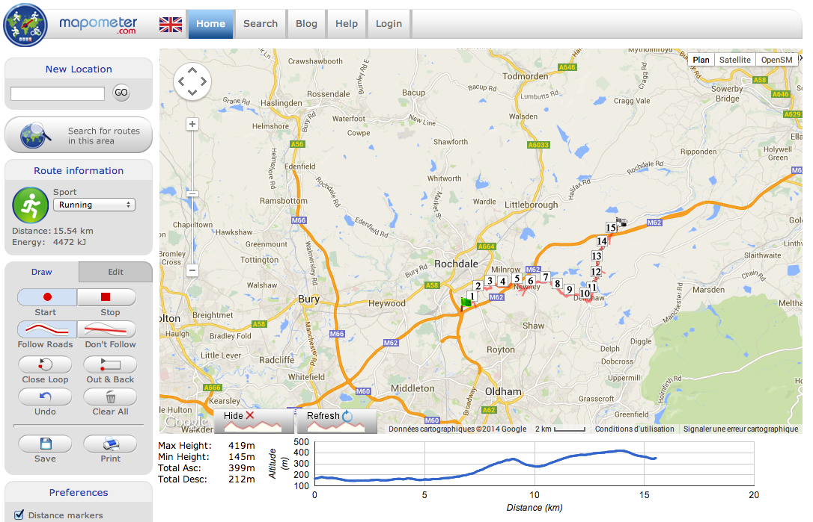

Enfin en parcourant leur site je suis trouvé une fonctionnalité très intéressante. J'ai créé un tracé sur la carte, puis j'ai changé de page sans le sauvegarder, et finalement en revenant sur la page de la carte le site propose de restaurer le tracé. Bonne idée !
 

### [Strava](www.strava.com)

Strava est un site qui accompagne les sportifs pendant et après leurs entraînements. Ce site a vraiment su cibler son public et lui donner exactement ce dont il avait besoin. Cela va de la récupération des données de course (tracé, allure, dénivelé, fréquence cardiaque) à l'analyse de celle-ci et l'interaction avec les autres utilisateurs. Et comme bonus, ils organisent des challenges où ils mettent les utilisateurs au défit et les gagnants remportent des cadeaux.

J'ai passé beaucoup de temps sur ce site pour prendre de l'inspiration, observer leur interfaces et utiliser leur site pour m'entraîner. Leur interface de création de tracé est aussi très bien développée; les contrôles sont intuitifs et l'aide est bien présente pour guider les utilisateurs.

J'ai repris beaucoup d'idées de ce site; comme l'organisation globale de la page et des menus de navigation. 

Un des points fort de leur site est qu'il incite et motive bien l'utilisateur à participer. Il y a des suggestions d'autres utilisateurs à suivre, la possibilité de rechercher des clubs, de proposer des challenges.

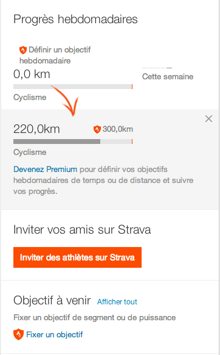

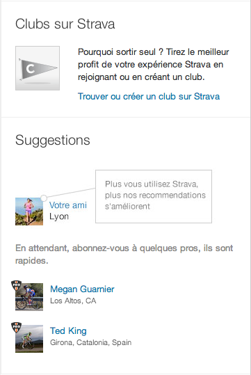

Ils proposent aussi une section «shop» où ils vendent leurs produits de sport. Ils en profitent pour placer leur propres publicités en bas de page.

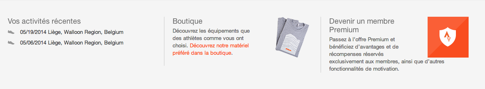

### [Runtastic](www.runtastic.com)

Runtastic est aussi un site qui accompagne les sportifs durant leurs entraînements. Il est beaucoup utilisé par les amateurs. C'est parce que le site est plus poussé au niveau de l'accompagnement et la motivation que sur l'analyse des entraînements (ils proposent aussi une analyse des performances).

### [Openrunner](www.openrunner.com)

Openrunner est un site d'organisation de randonnées/trails. Il cible surtout les personnes pratiquant ce sport à la montagne. Il propose de détailler les chemins et l'altitude avec une précision extrême. 

### [CalculItinéraires](www.calculitineraires.fr)

CalculItinéraires est un site spécialisé sur la création de tracés. Ils mettent à disposition des utilisateurs un nombre de fonctions impressionnant. Comme par exemple, la possibilité de changer de map (passer de Google map à Open Street Map). Il y a aussi beaucoup d'informations sur les tracés créés; outre l'élévation ils proposent de calculer les calories brulées, le temps en fonction de l'allure,… 

Personnellement, je ne prévois pas de donner autant d'informations sur les tracés.

## Conclusion

Tous ces sites ont des qualités et des défauts. Après avoir longtemps parcouru chacun, j'ai pu créer une liste des points forts et une des erreurs à éviter. Cette liste m'a guidé dans mon travail et m'a permis d'éviter les erreurs avant de les commettre. 

### Points forts à retenir

-	Accompagner les nouveaux utilisateurs lors la création de tracé.
-	Rendre la création de tracé la plus simple possible.
-	Pouvoir changer le fond de la map.
-	Inciter les utilisateurs à faire des actions.
-	Interface simple et intuitive.
-	Garder en mémoire le tracé créé.

### Erreurs à éviter

-	Demander trop d'informations d'un coup aux utilisateurs (long formulaires).
-	Créer des interfaces complexes.

Après l'observations de tous ces sites j'ai pu me lancer dans la conception de l'interface avec une idée claire vers quoi me diriger.

# 5.Conception de l'interface

Cette partie reprend les étapes par lesquelles je suis passé pour la conception de l'interface. Beaucoup de points sont directement liés à l'observations des sites dan le chapitre précédant.

## Maquettes zoning

Une des première étape est de réaliser des maquettes. C'est important pour ne pas se lancer aveuglément dans le design, et gagner de temps. Cela permet aussi de prévoir l'emplacement des fonctionnalités et l'architecture générale de la page. En début d'année j'avais fait une série de zonning, maintenant beaucoup de choses on changés.

L'idée était de présenter ces concepts à la classe pour que l'on discute ensemble. Ces brainstormings on permis à chaque étudiants d'avancer énormément dans la pré-conception de leur interface. Personnellement, beaucoup de commentaires reçu ce jour la m'ont ouvert les yeux sur certain défauts de conceptions. J'ai aussi reçu beaucoup d'idées de fonctionnalités. En conclusion, cette partie m'apporta beaucoup et me fit changer plusieurs mauvais choix que j'avais fait: voici les maquettes avant la réunion, et le site en suivant les conseils.

Image 6-1: Maquette du site en début d'année.
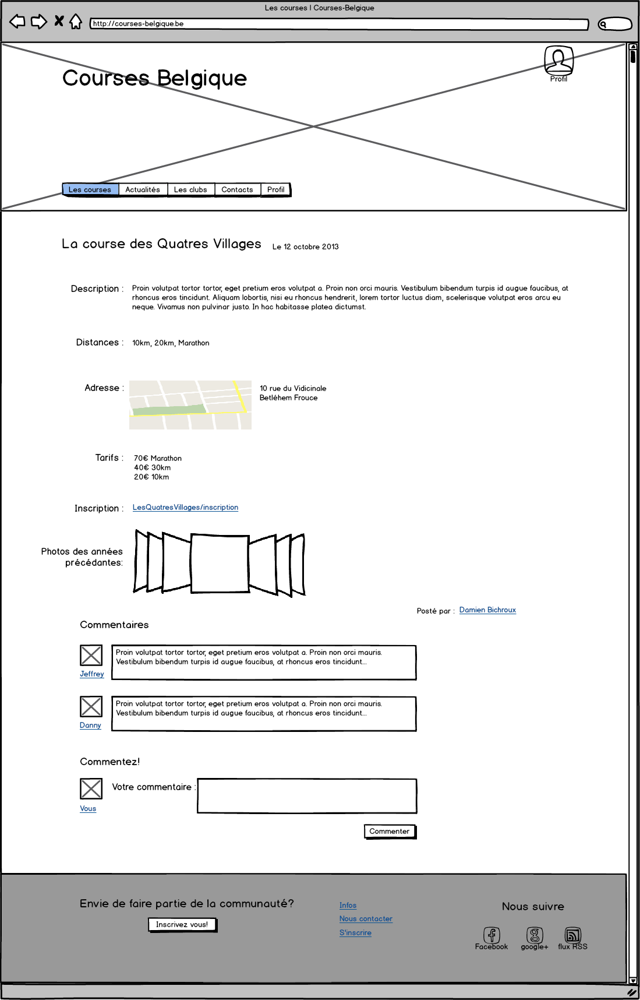
Image 6-2: même page que la maquette mais sur le site actuel.
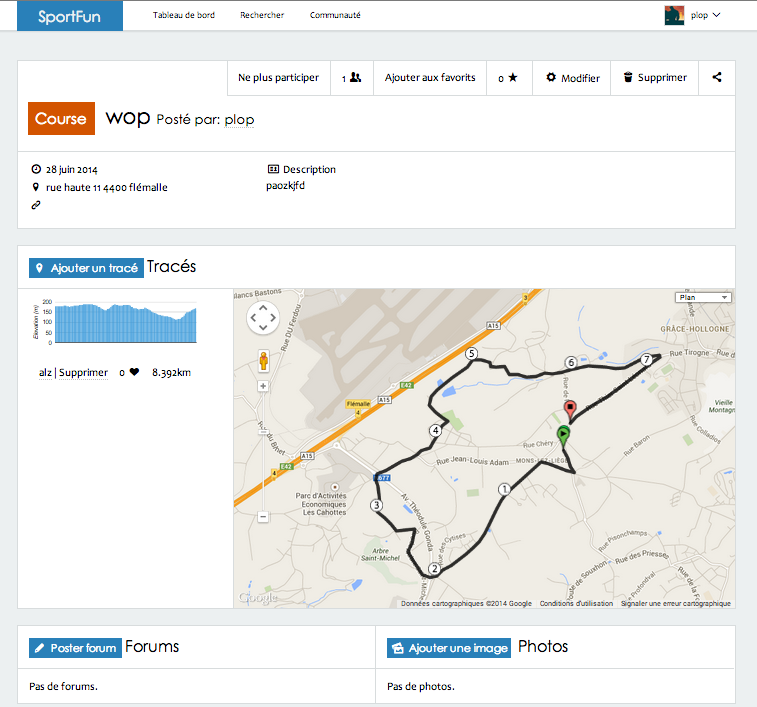

## Navigation
La navigation du site est composée de deux niveaux différents. La navigation principale située en haut de page, permet d'accéder aux différentes sections principales. Ensuite, au niveau du contenu se situe la navigation secondaire, qui elle, est différente en fonction de la section.

Exemple: 

Image 6-3: Utilisateur non connecté sur la section recherche.
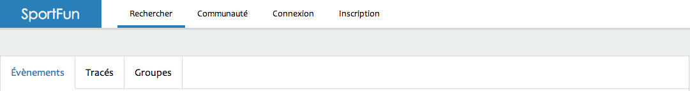

Image 6-4: Utilisateur non connecté sur la partie communauté.
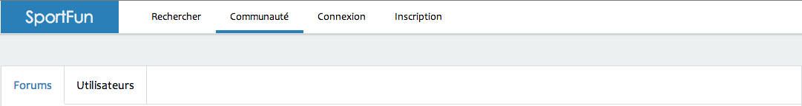

Image 6-5: Utilisateur non connecté sur le profil d'un autre utilisateur.
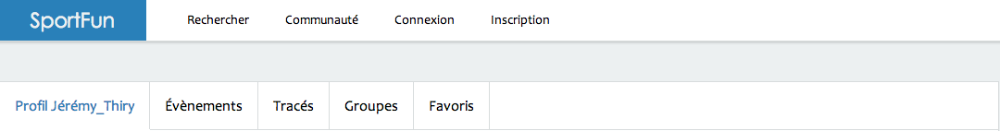

Image 6-6: Utilisateur connecté sur son tableau de bord.
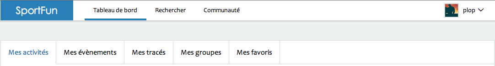

J'ai choisi ce type de navigation pour simplifier la navigation dans le site. Pour ce faire j'ai du déterminer les sections principales du site et regrouper les actions par sections. J'ai basé ceci sur les résultats du test des cartes dans la partie test utilisateurs.

Dans ce genre de navigation, si l'utilisateur veut rechercher quelque chose, il ne sera pas dérangé par les actions des autres sections. Mais j'ai quand même ajouter à chaque fois des liens renvoyant vers les autres sections, ou parfois directement vers des actions spécifiques. C'est aussi pour cela que le menu est en position fixe en haut de la page. Pour rappeler à chaque instant la présence de ces sections aux utilisateurs.

## Couleurs

Image 6-7: Voici la palette couleur du site.

Les couleurs sélectionnées sont des couleurs vives, offrant de bon contrastes. Le style principale de la page est dans les tons clairs (blanc, et gris clair), tandis que les actions sont dans des couleurs vives pour ressortir et attirer le regard. Ce genre de contraste est souvent utilisé sur le site pour donner envie à l'utilisateur d'effectuer des actions.

Image 6-8: exemple de bouton d'action.
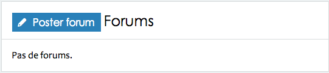

## Typographie

Pour la police de caractère des textes j'ai sélectionné cette font-stack: Candara, Calibri, Segoe, "Segoe UI", Optima, Arial, sans-serif. Avec en police principale «Candara» qui a un support de 83.41% sur windows et 38.74% sur Mac. J'ai sélectionné cette police surtout à cause de ses chiffres. En effet cette police possède des chiffres elzéviriens (minuscule), qui sont beaucoup plus agréables dans les blocs de textes que les normaux. Vu que ce site affiche souvent des chiffres: distances, prix, nombres d'entraînements… je me suis dit que cette police était parfaite.

Le texte de base est en 16px pour offrire un confort de lecture aux utilisateurs. De plus la police étant noir sur fond blanc, donc il n'y a aucun problèmes de contraste.

Image 6-9: voici la police Candara.

Et pour les titres voici la font-stack: "Century Gothic", CenturyGothic, AppleGothic, sans-serif. La police principale, «Century Gothic», à un support de 87.62% sur Windows et de 53.15% sur Mac. Mon choix c'est tourné vers cette police elle offre des courbes agréables qui retire la froideur que l'on pourrait retrouver sur Helvetica par exemple.

Image 6-10: voici la police Century Gothic.

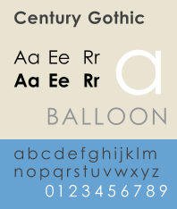

Voici l'échelle des titres créée sur http://typs.hupkens.be/ sur base π/2.

	h6      { font-size: 0.798em;}
	h5      { font-size: 0.893em;}
	h4      { font-size: 1em;}
	h3      { font-size: 1.12em;}
	h2      { font-size: 1.253em;}
	h1      { font-size: 1.403em;}
	

Image 6-10: voici le résultat de l'échelle des titres.

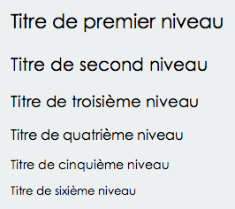

## Contenus non-textuels

Toutes les icones du site proviennent toutes de fontello (http://fontello.com).

## Adaptabilité

Il est important que le site s'adapte en fonction des conditions des utilisateurs. Qu'ils soient sur un smartphone, sur une tablette, ou sur un pc, le site doit pouvoir proposer ses services d'une manière convenable.

On oublie aussi souvent les utilisateurs qui n'ont pas javascript (ceux qui utilisent un lecteur d'écran par exemple). Il faut donc penser aussi à la dégradabilité du site.

### Responsive

Le site est responsive pour être utilisable sur n'importe quel appareil. J'ai donc créé une grille de base (avec «neat»), et cette grille s'adapte en fonction de plusieurs points.

Image 6-11: voici le site avec la grille activée.

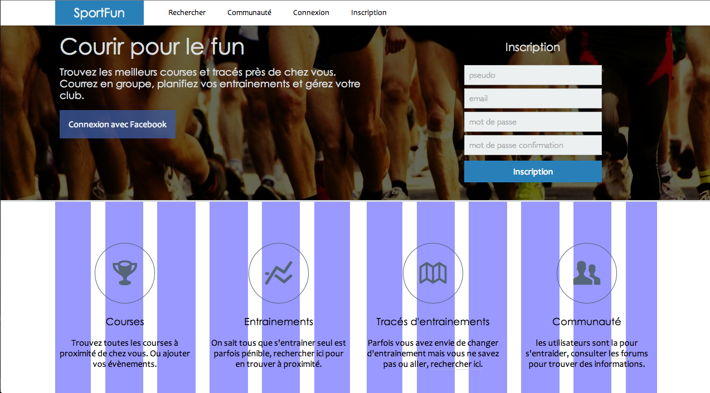

- 1080px pour les grands écrans.

- 935px passage aux écrans moyens, pas de changements depuis le breack-point précédant.

Image 6-12: voici le site en 1024px de large.

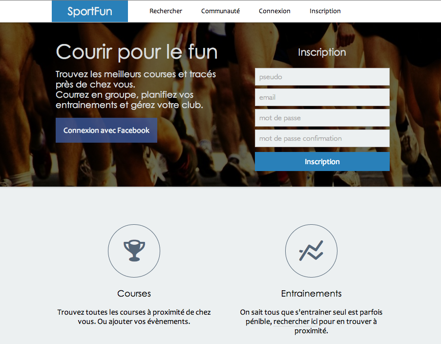

- 700px passage aux tablettes (et grands smartphones). Le breack-point s'explique surtout par le changement de navigation. Arrivé à cette largeur le menu principale est trop large, alors je le supprime et j'affiche un menu verticale en bas de page. Le bouton navigation qui remplace l'ancien menu est une ancre qui renvoi à la navigation en bas de page.

Image 6-13: voici le site en 650px de large.

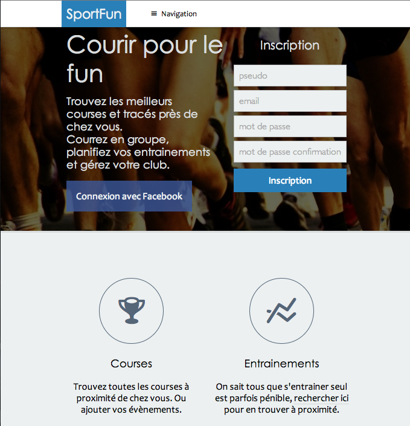

- 480px Finalement le passage aux versions mobiles. Á partir de ce point-ci, toutes les colonnes ont une longeur de 100%.

Image 6-13: voici le site en 450px de large.

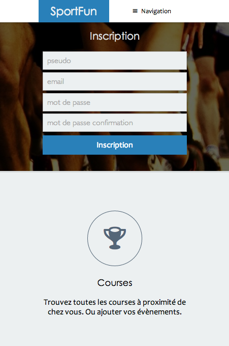

- 300px Pas de changements notables à cette largeur, juste une redimention.

### Dégradable

J'ai fait en sorte que les utilisateurs ne soient pas bloqués sans javascript. C'est à dire que les fonctionnalités de base fonctionnent sans javascript activé, et elles sont enrichies à son activation.

Prenons par exemple la liste des tracés sur la carte. Si jamais l'utilisateur ne dispose pas de javascript, je supprime la carte vu qu'elle ne fonctionnera pas, et je lui donne la liste des tracés.

Image 6-9: Liste des tracés avec javascript activé.
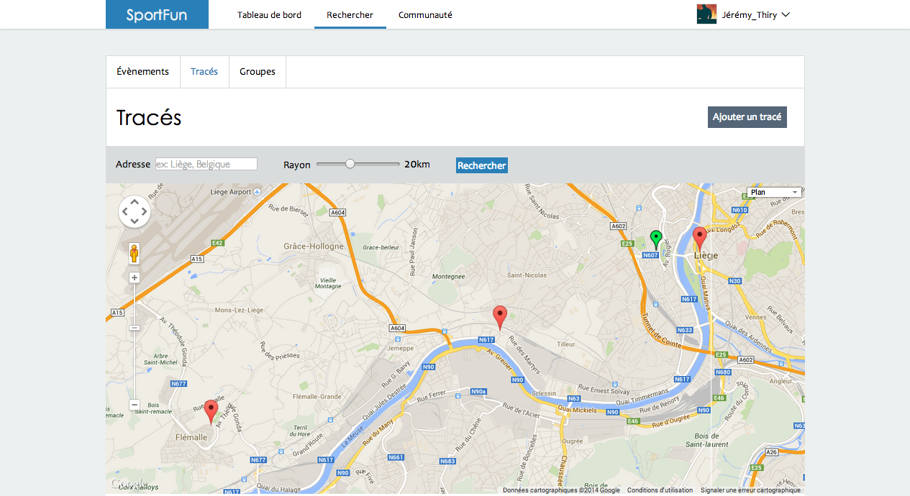

Image 6-10: Liste des tracés sans javascript.
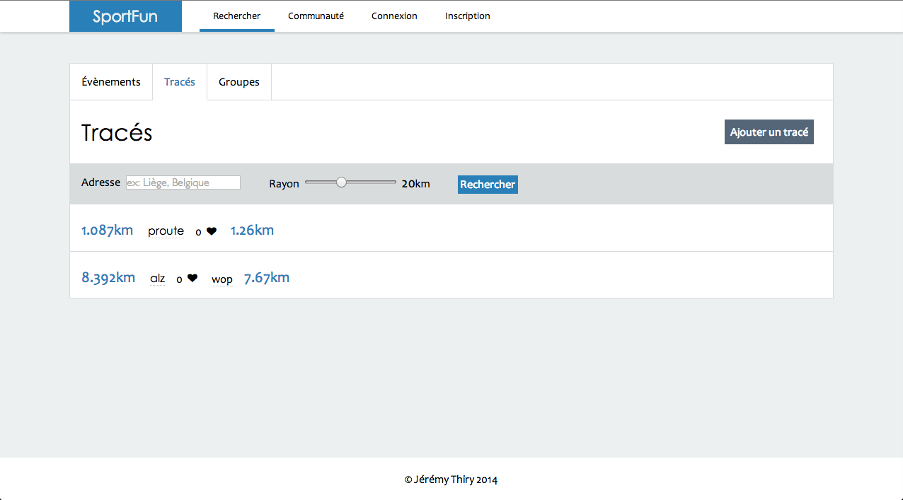

Une des seule partie qui n'est pas entièrement dégradable est la création de tracé. Evidement, si l'utilisateur n'a pas javascript il ne pourra pas créer de tracé sur la map. Néanmoins je peux toujours lui proposer de créer son tracé à partir d'un fichier.

## Architecture de l'information

### Sections principales

Le site est découpé en trois grandes sections principales. 

La première est le haut de page. Dans cette section on retrouve la navigation, le logo et sur la page d'accueil, une introduction et un formulaire d'inscription. Sur les autre pages, cette division a la taille la plus petite possible pour donner le plus d'espace possible au contenu.

La seconde section est le contenu. C'est dans cette partie que l'information principale du site se retrouvera. Pour améliorer la qualité visuelle du contenu, le fond est en blanc. Ce fond fait ressortir la section grâce au fond gris clair de la page.

La dernière section est le pied de page. Cette section ne comporte pas beaucoup d'informations. Elle est donc de petite taille. Sa couleur blanche, comme le contenu, la détache du fond mais moins que le contenu. En effet l'absence de bordure donne une impréssion de mélange avec le fond de la page.

# 8.Utilisabilité
## Tâches

Description des tâches à effectuer par les testeurs (chaque testeur a sa propre tâche à effectuer).

### 1. Utilisateur primaire

1. Créer un compte en utilisant l'interface du site.
	- Changer sa photo de profil.
	- Ajouter des informations personnels.

2. Ajouter un entraînement.
	- Créer un événement.
	- Ajouter un tracé à cet événement.
	- Participer à l'événement.
	- Télécharger le tracé d'entraînement.
	- Partager l'entraînement sur twitter.

3. Participer à une course.
	- Trouver une course près de chez lui à des dates qui lui conviennent.
	- Participer à la course.
	- Poster un forum sur cette course pour demander l'avis d'autres utilisateurs.

### 2.Utilisateur secondaire

1. Créer un compte en utilisant l'interface du site.
	- Changer sa photo de profil.
	- Ajouter des informations personnels.

2. Rechercher un tracé d'entraînement.
	- Trouver un tracé sur la carte d'exploration.
	- Inspecter les informations sur la page du tracé.
	- Ajouter le tracé au favoris.
	- Télécharger le tracé.
	- Partager le tracé sur google+
	
3. Rechercher un groupe d'entraînement.
	- Trouver un groupe d'entraînement qui lui convient.
	- Demander de faire partie du groupe.
	- Participer à un événement de groupe.
	
### 3.Utilisateur tertiaire.

1. Créer un compte via facebook.
	- Modifier les paramètres du compte.

2. Trouver une course intéressante.
	- Participer à la course.
	- Partager la course sur facebook.

## Tests utilisateurs

### 1.
___

Au moment de ces premiers tests, le design n'était pas le même. Beaucoup de parties n'étaient pas terminées, et la navigation n'était pas la même.

Pour bien comprendre ces tests, il faut avoir en tête la navigation du site. Il y avait une bar en haut du site qui comprenait ces items:

Pour un utilisateur hors ligne:

- Événements
- Tracés
- Forums
- Communauté
	- Utilisateurs
	- Groupes
- Connexion

Pour un utilisateur en ligne:

- Événements
- Tracés
- Forums
- Communauté
	- Utilisateurs
	- Groupes
- Ajouter
	- Événement
	- Tracé
	- Forum
	- Groupe
- Profil
- Déconnexion

Beaucoup d'éléments n'étaient que des icônes; pour déconnexion et communauté par exemple.

L'interface de création de tracé n'était pas terminée non plus. Certaines fonctions n'étaient pas disponible (annuler action, supprimer un point). Il y avait encore certaines erreurs qui n'étaient pas corrigées.

Dans ces premiers test j'ai surtout fait tester les interfaces de créations d'éléments.

#### Utilisateur M.

M. est une personne d'âge moyen (+30), qui travaille dans le domaine de l'enseignement. Il aime aussi particulièrement les randonnées à la campagne et EN le plein air.

M. est un utilisateur actif sur le web. Il effectue beaucoup de différentes actions sur le net comme par exemple les payements en ligne, recherche de vacances, achat de billet d'avion,… Néanmoins, il n'est pas toujours à l'aise dés que les interfaces deviennent un peu trop complexes.

L'utilisateur à effectué la tâche numéro 1.

Étape            | 1    |  2  |  3
---------------- | ---- | ----| ---- 
Temps            | 3min | 7min| 5min
Tâche accomplie? | oui  | oui | oui
satisfaction     | 4/7  | 3/7 | 4/7

##### Problèmes rencontré/difficultés

1. Créer un compte

Après avoir tenté de s'inscrire sur la page «connexion» l'utilisateur A compris, grâce aux messages d'erreurs qu'il devait changer de page.

Arrivé sur la page d'inscription, l'utilisateur A perdu du temps car la longueur du mot de passe n'était pas spécifiée; donc en rentrant un mot de passe de moins de 8 caractères et le site renvoi une erreur.

Mis à part cela, la création du compte reste une tâche assez rapide et ne décourage pas trop les utilisateurs.

2. Création d'un événement

L'utilisateur a d'abord cherché un à ajouter l'événement en passant le curseur sur le menu «Événements», pour finir par trouver le menu a"jouter". Le remplissage des informations se fait lentement car il n'y a pas d'explications. Il y a aussi une erreur car l'utilisateur n'a pas rempli tous les champs obligatoires, car ils n'étaient pas indiqués.

Après la création de l'événement, il a fallu ajouter un tracé dessus. L'interface de création à moitié terminé a quand même permis au testeur de créer son tracé sans trop de difficultés.

#### D.

L'utilisateur a effectué la tâche numéro 1.

Étape            | 1    |  2  |  3
---------------- | ---- | ----| ---- 
Temps            | 1min | 5min| 7min
Tâche accomplie? | oui  | oui | oui
satisfaction     | 5/7  | 4/7 | 3/7

##### Problèmes rencontré/difficultés

1. Création de compte (1min)

La création du compte en passant par le formulaire sur la page d'accueil est extrêmement rapide. Placer un formulaire d'inscription visible fut une bonne idée.
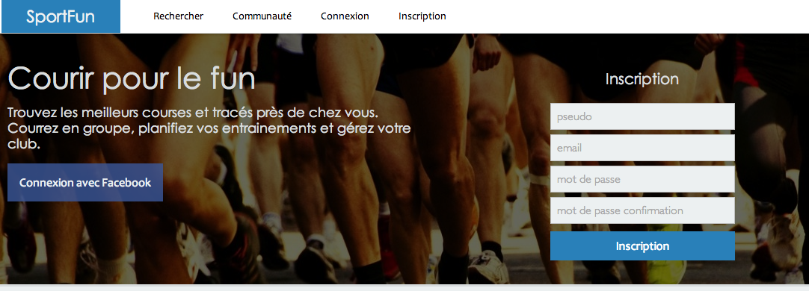

2. Création d'événement (5min)

Cet utilisateur avait une expérience précédente sur ce genre de site (www.calculitineraires.fr). La création de l'événement s'est donc déroulée sans embuches. Juste quelques soucis pour la prise en main de la création du tracé par manque d'accompagnement. Les flash info ne sont pas assez visibles.

3. Recherche d'événement (7min)

L'utilisateur est perdu lors de la recherche car les options de recherche ne sont pas affichées.

#### Conclusion après les premiers tests

##### Efficacité

On peut conclure que le site rempli son rôle et est efficace vu que toutes les tâches ont été effectuées avec succès. 

##### Efficience

Bien que le site soit efficace, l'efficience laisse à désirer… Les utilisateurs perdent beaucoup de temps à cause des interfaces bancales, de liens qui ne sont pas assez affordants, ou encore, une architecture de l'information inefficace. Le site n'épaule pas assez ses utilisateurs, ils sont donc obligés de tester par eux même jusqu'a ce qu'ils parviennent à leur fin.

##### Satisfaction

La satisfaction reflète le manque d'efficience du site. Quand les utilisateurs perdent du temps ou ne comprennent pas l'interface, ils sont insatisfaits et risquent de quitter le site avant d'avoir accompli leurs tâches. Il est donc primordiale d'augmenter l'expérience utilisateur pour garantir leur satisfaction.

##### Points à améliorer

Trouver un tracé sur la carte n'est pas intuitif. L'utilisateur ne pense pas à cliquer sur les marqueurs car ils ne sont pas affordants. Il faudrait soit les rendre plus affordants, soit indiquer des informations au survol ou bien mettre la liste des tracés sur une colonne.

Encore plus accompagner les utilisateurs lors de la création des tracés.

Suivi des utilisateurs lors du remplissage des formulaires. Beaucoup perdent du temps car ils ne remplissent pas un champ obligatoire, ou bien créent un mot de passe trop court. Donc, il faut prévenir les utilisateurs des champs obligatoires et informer de la spécificité des champs. L'aide aux formulaires est une étape importante qui influence beaucoup la satisfaction des utilisateurs. Je dois améliorer ce point pour les tests suivants.

Multiplier les chemins d'accès aux actions. C'est-à-dire qu'il ne doit pas y avoir qu'un seul chemin pour créer un tracé. Il faut donc ajouter des liens pour ces actions sur la page d'accueil, sur le tableau de bord de l'utilisateur. De la sorte il aura plus de chance de cliquer directement sur le bon lien. Dans la même idée, il faudrait améliorer la navigation dans le site.

Rappeler l'évènement sur lequel on crée un tracé. L'utilisateur est perdu quand il veut créer un tracé depuis un événement, et que sur la page de création, plus rien ne rappelle cet événement.

Lors des recherches, afficher les paramètres rentrés par l'utilisateur sur la page de résultats.

### 2.
___

#### S.

S. est un jeune étudiant de 16ans. C'est une personne qui est très sportive; natation, course à pied et vélo.

C'est quelqu'un d'habitué au monde de l'internet. Il passe la plupart de son temps libre, hors sport, à parcourir les forums, effectuer des recherches sur les nouveaux jeux, ou encore regarder des séries. C'est aussi un utilisateur quotidien de smartphone.

L'utilisateur à effectué la tâche numéro 1.

Étape            | 1    |  2  |  3
---------------- | ---- | ----| ---- 
Temps            | 2min | 2min| 3min
Tâche accomplie? | oui  | oui | oui
satisfaction     | 6/7  | 5/7 | 4/7

##### Problèmes rencontré/difficultés

L'utilisateur n'as pas directement compris le fonctionnement des forums.

#### T.

T. est un ouvrier d'une quarantaine d'années. Il passe son temps libre à s'entraîner en course à pied et participer à des joggings.

Il n'as pas une grande expérience dans le domaine du web, c'est pourquoi, il n'effectue que rarement des tâche dessus. Il y passe néanmoins du temps pour effectuer ses payements en ligne et relever ses mails.

L'utilisateur à effectué la tâche numéro 3.

Étape            | 1    |  2  |
---------------- | ---- | ----|
Temps            | 2min | 3min|
Tâche accomplie? | oui  | oui |
satisfaction     | 6/7  | 5/7 |

##### Problèmes rencontré/difficultés

Pas de difficultés rencontrées.

#### P.

P. est un jeune fonctionnaire. En dehors du travail c'est un triathlète. Il passe beaucoup de temps en entraînement. Il aime beaucoup regarder ses tracés effectués et les comparer avec les autres.

C'est un utilisateur courant du web. Il jongle entre réseaux sociaux, les recherches en tout genre ou encore l'achat de matériel sur internet. Il suit aussi beaucoup l'actualité sportive et est connecté en permanence avec internet (smartphone, tablette, ordinateur portable).

L'utilisateur à effectué la tâche numéro 2.

Étape            | 1    |  2  |  3
---------------- | ---- | ----| ---- 
Temps            | 3min | 3min| 2min
Tâche accomplie? | oui  | oui | oui
satisfaction     | 4/7  | 5/7 | 5/7

##### Problèmes rencontré/difficultés

L'utilisateur a attendu après avoir chargé une photo dans le champs «file», il s'attendait sûrement à voir la photo se mettre à jour directement.

#### Conclusion après les seconds tests

##### Efficacité

Comme pour la première série de tests, toutes les tâches ont étés accomplies avec succès.

##### Efficience

Il y a eu une nette amélioration de l'efficience par rapport aux premiers tests. Depuis les améliorations les utilisateurs trouvent plus vite ce qui les intéresse.

##### Satisfaction

De fait la satisfaction à également augmentée.

##### Points à améliorer

Montrer directement le changement de l'image de profil pour que les utilisateurs n'attendent pas le changement qui ne se produira pas.

Il faut aussi ajouter des explications dans la catégorie forums. Je me suis surtout concentré sur la création de tracés et d'événements mais il ne faut pas que je néglige les autres parties.

### Compte rendu général des tests

C'est tests utilisateurs m'ont permis d'améliorer la qualité générale du site. Cela m'a aussi ouvert les yeux sur de grosses erreurs de conceptions et ainsi donné l'occasion de rectifier le tir. C'est souvent quand les personnes commencent à utiliser le site que les problèmes de conception se révèlent. Ce qui rend cette étape si cruciale.

Ces deux batteries de tests ont été très utiles mais il ne faut pas se reposer sur ses lauriers. Le but est de rester constamment à l'écoute de ses utilisateurs et d'améliorer le site sans cesse. Pour, au finale, leur offrir la meilleur expérience utilisateur possible.

# 10.Technologies du site

## Intégration

L'intégration se fait via le moteur de templates erb de rails. Côté client j'ai utilisé toute une liste d'outils pour améliorer la qualité du site et augmenter ma productivité.

### Outils utilisés

-	Modernizer

	Principale utilité est de tester si l'utilisateur à JavaScript activé. Pour pouvoir rendre le site dégradable.

-	jQuery

	Cette bibliothèque est chargée pour accélérer le développement du code JavaScript.
	
-	coffeeScript

	Pré-processeur javascript. Ce langage rend l'écriture du javascript plus courte et rapide.

	
-	scss

	Pré-processeur CSS, qui rend la création des feuilles de styles vraiment puissant. Les fonctionnalités de SCSS utilisées sont la créations de variables globales, ajout des média-queries dans les éléments, utilisation de mixines pour des actions qui se répètent,… 

-	gmap

	Bibliothèque principale pour tous ce qui apparait sur les cartes: la création des tracés à l'affichage de ceux-ci.

-	Eloys

	C'est une bibliothèque qui facilite la manipulation des polyline avec google map. En effet, un grand nombre de fonctions (essentiellement de calcul) sont ajoutées. Par exemple, des fonction de calcule de distance le long d'une polyline.

## Côté serveur

Détails des technologies utilisées côté serveur.

### Rails

J'ai décidé de développer ce projet avec Ruby on Rails pour plusieurs raisons:

-	Premièrement pour faire une nouvelle expérience. On a surtout travaillé avec PHP en cours, je voulais voir un autre langage par curiosité.
-	Ensuite ce framework est très utilisé dans le domaine du web, donc c'est un plus dans mon profil personnel.

#### Retour d'expérience

Ce framework est vraiment simple à prendre en main pour une personne qui a déjà une expérience avec un autre framework. Sur le site consacré à Ruby on Rails, il y a une partie concernant la documentation qui est vraiment bien détaillée pour les bases. Ensuite, leur API est claire et bien documentée.

Mon expérience avec Laravel m'a beaucoup aidé car il est inspiré en grande partie de Rails. J'ai donc vite été en confiance avec l'organisation des fichiers et la logique générale. Le framework à aussi accéléré mon temps de développement. En effet, beaucoup de fonctionnalités sont déjà mises en place; comme travailler avec des pré-processeurs. De base scss et coffeeScript sont installés et le développeur n'a pas besoin de perdre du temps à configurer son environement de travail pour compiler ses assets.

Avec rails j'ai appris à ne pas me compliquer la tâche. Souvent, je développais des parties du site et quelques semaines après en relisant le code, je supprimais la moitié pour donner un résultat identique. Plus je comprenais le framework, plus mon code devenais simple et efficace.

#### Ruby gems

Les gems sont à Ruby ce que sont les packages à PHP. Il existe un grand nombre de gems dans le monde de Ruby, toutes recensées sur [rubyGem](https://rubygems.org/). Voici la liste des gems utilisées dans mon projet, leur avantages et pourquoi j'ai décidé de travailler avec.

-	turbolinks

	Cette technologie permet d'accélérer considérablement la navigation sur le site. En effet, cela utilise ajax pour recharger seulement le contenu de la page qui change. Le but est d'améliorer l'expérience utilisateurs avec de chargements de page plus rapides.
	
	-	jQuery-turbolinks
	
		Cette gem rend l'utilisation de jQuery avec turbolinks possible. Car à cause de turbolinks, les pages ne sont plus rechargées durant la navigation sur le site, cela peu provoquer des bugs avec jQuery car les noeuds liés aux événements n'existent plus. Cette gem lie les évènements déclenchés par turbolinks à jQuery.
-	devise

	Gem gérant toute la partie compte d'utilisateurs, connexion, sessions,... Ayant choisi de développer mon PFE en Ruby assez tardivement j'ai du faire des choix pour rattraper le temps perdu. Devise fait partie de ces choix. Le gain de temps que 
j'ai obtenu grâce à cette gem est considérable. 

	-	omniauth
	
		Ceci est une extension de Devise. C'est pour permettre aux utilisateurs de se connecter via Facebook à l'application.
		
-	carrierwave

	Carriewave se charge de l'upload des fichiers. 
	
	-	fog
	
		Gère les connexions vers des clouds. Je l'utilise pour connecter carriewave à Amazon s3.
		
	-	mini_magick
	
		Mini_magick est utilisé pour la manipulation d'image. Par exemple, les images des profils utilisateurs sont mises à l'échelle, et pour ne pas déformer les images il faut les recarder. Mini_magick est une bibliothèque qui permet d'effectuer ces actions avec une grande simplicité.
		
-	nogokiri

	Nogokiri est un parser (html, xml). Un des objectifs du site est de créer des tracés et de permettre aux utilisateurs de les exporter. Les fichiers exportés (.gpx) sont au format xml et Nogokiri qui est aussi un outil de création de fichiers.
	
-	autoprefixer-rails

	Préfixer automatiquement les règles CSS.
	
-	bourbon

	Bibliothèque SASS pour utiliser Neat.
	
	-	neat
	
		Neat est un système de grille SASS.
		
-	polyline

	Permet d'encoder des tableaux de coordonnées en polylines google. C'est polylines encodées permettent de prendre moins de place dans la base de données. Pour récupérer les coordonnées, il suffit de faire un appel à l'API googlemap.
	
-	geocoder

	Geocoder est un système de géocodage. Le principe est de lui donner des coordonnées et il renvoi des données comme la ville, le pays,… Il permet aussi de faire des queries sur des modèles qui sont géocodé. C'est à dire que quand on peut lui demander de lister les résultats proche de certaines coordonnées et il va les lister en fonction de leur distance par rapport à cette position. Je l'utilise pour lister les tracés en fonction de la position de l'utilisateur.

-	dotenv-rails

	Gérer les variables d'environnement. Le but est de protéger les données sensibles (mot de passes, clés secrètes,… ) et de les retirer du contrôle de version (git).

-	redcarpet

	Parser Markdown pour les forums.
	
-	will-paginate

	Gérer la pagination.

### Heroku

En début d'année je me suis acheté un hébergement chez OHV. Malheureusement, ils ne permettent pas d'utiliser ruby sur leurs serveurs. J'ai donc dû chercher une solution et un de mes objectifs était de faire le moins de dépenses possible (j'avais envie de me fixer une limite de frais pour développer et mettre en ligne une première version).

Mon choix c'est donc naturellement tourné vers [Heroku](heroku.com).

Cet hébergeur permet de déployer rapidement des applications. Grâce à une configuration simple et beaucoup d'outils mis à notre disposition. L'avantage est que le code en ligne est sur un dépôt git, et chaque fois que l'on veut pousser des changements sur le site en ligne il suffit de faire un commit sur ce dépôt git. Heroku se charge du reste; comme la compilation des assets, mise à jour des gems,...

L'autre gros avantage est que le service est gratuit. C'est assez important car cela permet de tester de nouveaux projets en ligne rapidement et sans avoir de serveur. Il y a des restrictions dans la taille de la base de données et certains plugins bien évidement.

Bien qu'Heroku m'a permis de gagner beaucoup de temps, il devait y avoir une contrepartie à cette gratuité. Et cette contrepartie est que tous les fichiers uploadés par les utilisateurs sont supprimés après chaque commit. Je ne m'en étais pas rendu compte directement et j'ai vite du trouver une solution à ce problème. Effectivement, ne pas pouvoir faire évoluer le site sans supprimer les fichiers des utilisateurs ce n'est pas admissible.

### Amazon s3

La solution (pour rester dans la gratuité), fut d'uploader les fichiers des utilisateurs sur un cloud. Mon choix s'est dirigé vers amazon web service qui propose un cloud avec 5giga d'espace gratuit. Pour la première mise en ligne de Sportfun c'est plus que suffisant, car dépasser les 5giga avec des images et des fichiers .gpx il faut beaucoup d'utilisateurs, ce qui me laisse le temps de trouver une solution (ou de passer à la version payante).

Ce service est vraiment simple à utiliser et amène beaucoup d'avantages pour le développement d'application web. Par exemple, si je veux changer d'hébergement il me suffit d'exporter la base de données, pousser mon code sur le nouveau serveur, importer la base de données et les fichiers seront toujours accessibles. Si j'ai un problème sur le serveur les fichiers des utilisateurs sont en sécurité.

### Base de donnée

Voici le schémas de la base de données en simplifié. C'est-à-dire que je ne montre pas les données stockées dans les tables mais surtout les relations entre elles.

Le plus complexe dans la base de données à été de permettre aux utilisateurs de créer leur tracé. J'ai essayé plusieurs approches.

Le premier moyen que j'avais mis au point était de proposer à l'utilisateur d'uploader un fichier de type tcx, gpx ou kml et je m'occupais de le parser pour l'afficher sur une map.

Ensuite, j'ai décidé de proposer à l'utilisateur de créer son tracé sur une map en directe, c'est à ce moment que les problèmes on commencés. J'avais réussi à lui faire faire un tracé sur une map, envoyer les données et avec celles-ci je voulais générer un fichier kml pour le stocker dans un dossier «uploads» . La seule information dans la base de données n'étant que le nom du fichier (d'ailleurs la première méthode fait pareil).

J'avais presque réussi à générer le fichier kml puis je me suis rendu compte que ma technique pour stocker l'information n'était pas très flexible. Rester attacher à des fichiers était un problème. En faisant des recherches sur internet j'ai trouvé qu'il y a deux techniques pour stocker des polylines (le tracé). 

J'ai d'abord choisi la première qui consistait à créer une table «tracks», une «tracksegments» et une «points». La «tracks» stocke les informations générales du tracé, «tracksegments« est une table pivot entre «tracks» et «points» et «points» stocke tous les points (latitude, longitude) d'un tracé.

Cette solution est la plus flexible. Donc tout était fonctionnel: stocker un tracé dans la base de données manuellement à partir d'une map. Le seul problème (oui il y en a toujours) c'est la quantité énorme de lignes que cela prend dans la base de données. Pour 3-4 tracés j'en étais déjà à plusieurs millier de lignes dans la table «points»…

De plus, je ne prévois pas d'exécuter des queries sur les cordonnées dans la table points (ce qui était le seul but de cette technique). J'ai donc opté pour la solution numéro deux.

Elle consiste à sérialiser une polyline en une chaîne de caractères et simplement la stocker dans un champ texte. C'est plus simple et ça ne prend qu'une seule ligne par tracé. J'ai donc supprimé les tables «points» et «tracksegments» et je stocke le tracé dans la table «tracks».
